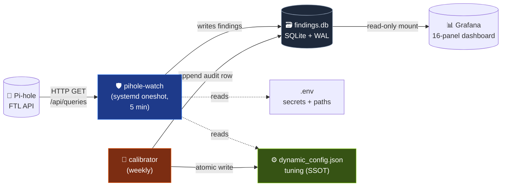
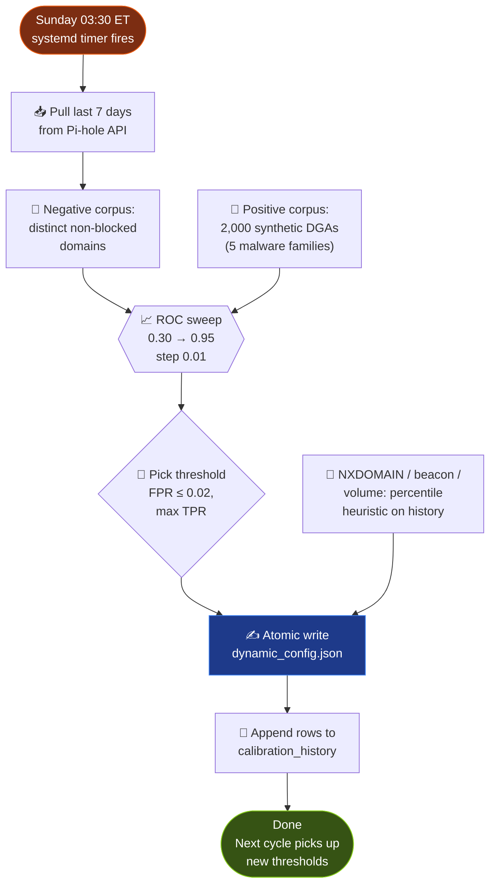
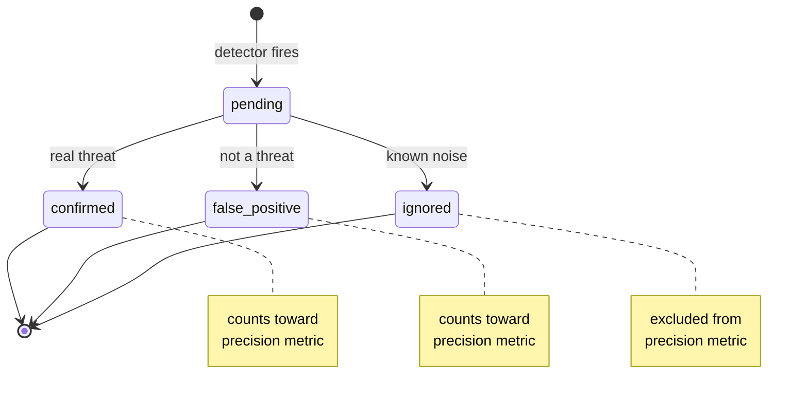

<div align="center">

# 🛡️ pihole-watch

**An AI/ML threat-detection sidecar for [Pi-hole](https://pi-hole.net/).**

*Read-only. Autonomous. Fail-loud. Runs in 350 ms on a Pi 5.*

[]()
[]()
[]()
[]()

</div>

---

`pihole-watch` pulls the Pi-hole query log every 5 minutes, runs four
lightweight detectors, and writes findings to its own SQLite store.
Detector thresholds **autonomously recalibrate weekly** from your own
traffic — no manual tuning, no model files, nothing in the DNS hot
path.

The point is to demonstrate value with simple, proven techniques rather
than chase state-of-the-art ML.

---

## 🔍 Detectors

| | Detector | What it catches | Heuristic |
|:---:|---|---|---|
| 🎲 | **DGA** | Algorithmically generated domains (malware C2 fallback) | Length × entropy × vowel ratio × consonant runs × digit mix |
| ❌ | **NXDOMAIN spike** | Client hitting NXDOMAIN at elevated rate | Per-client NX rate over rolling window |
| 📈 | **Volume anomaly** | QPS far from rolling baseline | EWMA of QPS, flag at N pseudo-sigma |
| 📡 | **Beacon** | Periodic queries with low jitter (C2 heartbeat) | Coefficient of variation of inter-arrival times |

Each run also captures Pi-hole's own metrics into `pihole_snapshots` so the
Grafana dashboard has 5-minute-granular history of block rate, cache-hit
rate, top-blocked domain, etc.

---

## 🏗️ Architecture

Three layers, each with one job. **Config is config; data is data.**



| Layer | Purpose | What lives here |
|---|---|---|
| 🔐 `.env` | Secrets + paths only | `PIHOLE_PASSWORD`, DB path, log path |
| ⚙️ `dynamic_config.json` | **Current tuning values (SSOT)** | All 7 thresholds + windows |
| 🗃️ `findings.db` (SQLite) | Observations only | Findings, baselines, snapshots, calibration history |

Code reads `dynamic_config.json` fresh every cycle — a manual edit takes
effect on the **next 5-minute tick**, no restart. The autonomous calibrator
atomic-writes the same file weekly. Threshold drift goes to
`calibration_history` so you can graph it.

---

## ⚡ Quick start

```bash
# 1. Clone + venv (project-local, not shared)
git clone https://github.com/strommy76/pihole-watch.git
cd pihole-watch
python3 -m venv .venv
.venv/bin/pip install -r requirements-dev.txt

# 2. Secrets + tuning
cp .env.example .env
$EDITOR .env                                          # set PIHOLE_PASSWORD
cp dynamic_config.example.json dynamic_config.json    # if not already

# 3. Run once manually
PYTHONPATH=$(realpath ..) .venv/bin/python -m pihole_watch.main

# 4. Tests (93 passing)
PYTHONPATH=$(realpath ..) .venv/bin/python -m pytest tests/ -q

# 5. Install the systemd timers
sudo cp pihole-watch.service           /etc/systemd/system/
sudo cp pihole-watch.timer             /etc/systemd/system/
sudo cp pihole-watch-calibrate.service /etc/systemd/system/
sudo cp pihole-watch-calibrate.timer   /etc/systemd/system/
sudo systemctl daemon-reload
sudo systemctl enable --now pihole-watch.timer pihole-watch-calibrate.timer
```

| Timer | Cadence | What it does |
|---|---|---|
| `pihole-watch.timer` | **every 5 min** | Detection cycle |
| `pihole-watch-calibrate.timer` | **Sundays 03:30 local** | ROC + percentile recalibration |

Both are `oneshot` — they exit cleanly after each run.

---

## ⚙️ Configuration

### `.env` — secrets + paths only

```bash
PIHOLE_URL=http://localhost:8080
PIHOLE_PASSWORD=...
WATCH_DB_PATH=/home/pistrommy/projects/pihole-watch/findings.db
LOG_PATH=/home/pistrommy/projects/pihole-watch/watch.log
```

> 🚫 **Anything tunable does NOT belong here.** Tuning lives in JSON.

### `dynamic_config.json` — tuning (SSOT)

```json
{
  "_meta": { "schema_version": 1, "last_calibrated_at": "2026-04-26T..." },
  "lookback_minutes": 6,
  "beacon_lookback_minutes": 60,
  "beacon_min_occurrences": 6,
  "dga_threshold": 0.77,
  "nxdomain_rate_threshold": 0.473,
  "beacon_max_interval_cv": 0.20,
  "volume_sigma_threshold": 10.0
}
```

**A/B testing is just an edit.** Want a tighter DGA filter?
`vim dynamic_config.json`, save, the next 5-minute cycle picks it up.
Manual changes survive until the next weekly calibration overwrites them.

---

## 🎯 Autonomous calibration

Detector thresholds drift as your traffic mix changes. Manual tuning
doesn't scale, so the calibrator re-derives all four thresholds from
**your own traffic** every Sunday at 03:30.



### DGA threshold — ROC analysis

1. Pull the past 7 days of distinct non-blocked domains as a real-traffic
   negative corpus *(Pi-hole already filters known threats — those would
   skew the corpus)*
2. Generate 2,000 synthetic DGA-style domains across 5 malware families
   *(Conficker, Cryptolocker, Banjori, Necurs, pseudoword)*
3. Score both corpora, sweep thresholds **0.30 → 0.95 in 0.01 steps**
4. Pick the threshold meeting `target_fpr ≤ 0.02` while maximising TPR;
   tie-break on the more conservative threshold

### NXDOMAIN / beacon / volume — percentile heuristics

Bounded percentiles on the real distribution, clamped to sane floors and
ceilings so a quiet week can't push the bar to zero.

```bash
# Run calibration on demand
.venv/bin/python -m pihole_watch.cli calibrate

# View current values + drift history
.venv/bin/python -m pihole_watch.cli show-calibration
```

---

## 🚨 Findings + triage

Every finding carries a triage outcome. Default `pending`; you graduate
each finding into one of three terminal states:



| Outcome | Meaning | Affects precision? |
|---|---|:---:|
| ✅ `confirmed` | Real threat | yes (numerator) |
| ❌ `false_positive` | Not a threat | yes (denominator only) |
| 🔇 `ignored` | Known-noisy / known-benign | no |
| ⏳ `pending` | Not yet reviewed | no |

**Severity ladder** (set by `main.py` based on score × evidence):

```
ℹ️  info   →  🟢 low   →  🟡 medium   →  🔴 high
```

`info` means below sample threshold (e.g., NX rate over a tiny sample);
`high` means dense evidence and an extreme score.

---

## 🖥️ CLI

```bash
PYTHONPATH=$(realpath ..) .venv/bin/python -m pihole_watch.cli <command>
```

| Command | Purpose |
|---|---|
| `list [--limit N] [--outcome O] [--type T]` | Print recent findings, filtered |
| `triage FINDING_ID --outcome O [--note "..."]` | Stamp a finding's outcome |
| `summary [--since YYYY-MM-DD]` | Per-detector triage rollup with precision % |
| `weekly-report` | Markdown summary for the last 7 days |
| `calibrate` | Run autonomous threshold calibration now |
| `show-calibration` | Print current tuning vs defaults + recent history |

```bash
# Last 20 pending DGA findings
... cli list --type dga --outcome pending --limit 20

# Mark one as a false positive with context
... cli triage 42 --outcome false_positive --note "CDN edge name"

# Generate a weekly markdown report
... cli weekly-report > /tmp/pihole-watch-week.md
```

The weekly report flags any detector running below ~25% precision (with
≥5 judgments) — a hint to tighten that detector's threshold before the
next calibration.

---

## 🗃️ Reading the database

```bash
# Latest findings
sqlite3 findings.db "SELECT detected_at, finding_type, severity, client_ip,
  domain, score FROM findings ORDER BY detected_at DESC LIMIT 50;"

# Run health
sqlite3 findings.db "SELECT * FROM run_log ORDER BY run_at DESC LIMIT 10;"

# Threshold drift over time
sqlite3 findings.db "SELECT * FROM calibration_history
  ORDER BY calibrated_at DESC LIMIT 20;"

# Findings in the last hour, by type
sqlite3 findings.db "SELECT finding_type, COUNT(*) FROM findings
  WHERE detected_at > datetime('now', '-1 hour') GROUP BY finding_type;"
```

---

## 📊 Grafana setup

The dashboard at `grafana/pihole-watch.json` has 16 panels covering the
snapshot timeline, findings, triage status, and detector health.

It uses [`frser-sqlite-datasource`](https://grafana.com/grafana/plugins/frser-sqlite-datasource/)
with UID `pihole-watch-sqlite-ds` pointing at this repo's `findings.db`.

**1. Datasource** — provision in Grafana:

```yaml
apiVersion: 1
datasources:
  - name: pihole-watch SQLite
    type: frser-sqlite-datasource
    uid: pihole-watch-sqlite-ds
    jsonData:
      path: /var/lib/pihole-watch/findings.db
```

**2. Volume mount** — Grafana needs read access to `findings.db`. SQLite
WAL mode also writes `findings.db-wal` / `findings.db-shm` alongside, so
mount the whole directory **read-only**:

```yaml
services:
  grafana:
    volumes:
      - /home/pistrommy/projects/pihole-watch:/var/lib/pihole-watch:ro
```

**3. Dashboard** — drop `grafana/pihole-watch.json` into your
provisioning dashboards directory; reload Grafana.

The dashboard refreshes every 5 minutes — same cadence as the watcher.

---

## 📁 Project structure

```
pihole-watch/
├── 🐍 pihole_watch/
│   ├── api.py             ← Pi-hole HTTP client (auth, fetch_queries)
│   ├── dga.py             ← DGA scoring heuristic
│   ├── anomaly.py         ← NXDOMAIN-rate + volume-anomaly detectors
│   ├── beacon.py          ← Periodic-query / C2 beacon detector
│   ├── findings.py        ← SQLite store + DAO
│   ├── calibrate.py       ← ROC + percentile threshold calibration
│   ├── config.py          ← Two-layer config loader (.env + JSON)
│   ├── main.py            ← systemd-oneshot entry point
│   └── cli.py             ← list / triage / summary / calibrate
├── 🧪 tests/              ← 93 tests (pytest)
├── 📊 grafana/
│   └── pihole-watch.json  ← 16-panel dashboard
├── 🔧 scripts/
│   └── install-ollama.sh  ← Manual Ollama install for LLM triage
├── ⚙️  dynamic_config.example.json
├── 🔐 .env.example
├── 📦 requirements.txt          ← runtime deps
├── 📦 requirements-dev.txt      ← + pytest
└── 🚀 pihole-watch{.service,.timer}
    pihole-watch-calibrate{.service,.timer}
```

---

## 📐 Design principles

These are non-negotiable for the project:

| | Principle | Practical rule |
|:---:|---|---|
| 👀 | **Read-only consumer** | Never writes back to Pi-hole; findings live in our own DB |
| 🔔 | **Fail-loud** | Missing config, API errors, DB errors all surface; nothing silent |
| 🧱 | **Config separation** | `.env` for secrets/paths, JSON for tuning, DB for observations — never mixed |
| 🎯 | **No fallback chains** | The config IS the source. No bootstrap rows mirroring config into data |
| 🚫 | **No magic numbers in code** | Every tunable threshold lives in the JSON. Monte Carlo / ROC writes the JSON, never the source |
| 🧩 | **Sidecar pattern** | Own venv, own DB, own systemd unit — no cross-contamination with other services on the host |

---

## 🛣️ Roadmap

- 🧠 **Local-LLM triage** for borderline DGA findings (score 0.65–0.85)
  using Ollama with `qwen3:4b` on the same host. Install script ready
  at `scripts/install-ollama.sh`; triage module is the next piece.
- 📡 **Per-client beacon baselines** *(currently per `(client, domain)` only)*.
- 📊 **Calibration-drift panel** in Grafana.

---

## 📜 License

MIT. See `LICENSE` if/when added.
